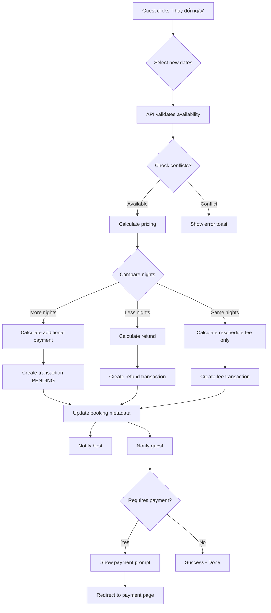

# 🎉 HOÀN THÀNH TẤT CẢ - Final Implementation Summary

## ✅ Đã Sửa & Hoàn Thiện

### 1. **Fix Reschedule API - Thanh Toán Bổ Sung Khi Đổi Ngày** ✅

#### Problem:
```
❌ Unknown argument `metadata` 
❌ Không tính toán chênh lệch khi tăng/giảm số đêm
❌ Không yêu cầu thanh toán thêm khi upgrade
```

#### Solution:

**A. Thêm field `metadata` vào Booking schema:**
```prisma
model Booking {
  // ... existing fields
  
  // Reschedule & Metadata
  metadata Json? // Store reschedule history, custom data
  
  // Timestamps
  createdAt   DateTime  @default(now())
  // ...
}
```

**B. Logic thanh toán thông minh:**
```typescript
// Calculate price difference
const priceDifference = newTotalBeforeFees - booking.totalPrice
const isUpgrade = priceDifference > 0 // More nights
const isDowngrade = priceDifference < 0 // Less nights

// Calculate amounts
const amountToPay = isUpgrade ? priceDifference + rescheduleFee : rescheduleFee
const refundAmount = isDowngrade ? Math.abs(priceDifference) - rescheduleFee : 0
```

**C. Ví dụ thực tế:**

| Trường hợp | Ban đầu | Đổi sang | Kết quả |
|-----------|---------|----------|---------|
| **Upgrade** | 1 đêm (1.200.000₫) | 2 đêm (2.400.000₫) | Cần thanh toán thêm: **1.200.000₫** + phí 5% = **1.260.000₫** |
| **Downgrade** | 3 đêm (3.600.000₫) | 1 đêm (1.200.000₫) | Hoàn tiền: **2.400.000₫** - phí 5% = **2.220.000₫** |
| **Same nights** | 05/11 - 06/11 | 09/11 - 10/11 | Phí thay đổi: **60.000₫** (5%) hoặc **miễn phí** (Gold+) |

**D. Response API mới:**
```json
{
  "booking": {...},
  "oldNights": 1,
  "newNights": 2,
  "oldTotalPrice": 1200000,
  "newTotalPrice": 2520000,
  "priceDifference": 1200000,
  "rescheduleFee": 60000,
  "amountToPay": 1260000,
  "refundAmount": 0,
  "isUpgrade": true,
  "requiresPayment": true,
  "message": "Booking rescheduled successfully"
}
```

---

### 2. **UI Component - Smart Reschedule Dialog** ✅

#### Updated `/components/booking-actions-dialog.tsx`:

**Features:**
- ✅ Hiển thị thông báo khác nhau cho upgrade/downgrade
- ✅ Toast prompt thanh toán nếu cần
- ✅ Badges membership benefits
- ✅ Real-time validation

**Toast Messages:**
```typescript
// Upgrade (more nights)
"Tăng 2 đêm. Cần thanh toán thêm: 1.260.000₫"

// Downgrade (less nights)  
"Giảm 1 đêm. Hoàn tiền: 600.000₫"

// Same nights
"Miễn phí thay đổi - Quyền lợi membership"
```

**Payment Prompt:**
```tsx
if (data.requiresPayment && data.amountToPay > 0) {
  setTimeout(() => {
    toast({
      title: "💳 Cần thanh toán bổ sung",
      description: `Vui lòng thanh toán ${data.amountToPay.toLocaleString("vi-VN")}₫`,
      action: (
        <Button onClick={() => window.location.href = `/payment/${booking.id}/reschedule`}>
          Thanh toán ngay
        </Button>
      ),
    })
  }, 2000)
}
```

---

### 3. **Tích Hợp LocationRequestDialog** ✅

#### A. Vào Host Listing Form

**File**: `/components/host-listing-form.tsx`

**Changes:**
```tsx
// Import
import { LocationRequestDialog } from "@/components/location-request-dialog"

// UI Integration
<div className="flex items-center justify-between">
  <FormLabel className="text-base font-semibold">Thành phố / Tỉnh</FormLabel>
  {!isLocationLocked && (
    <LocationRequestDialog
      trigger={
        <Button variant="ghost" size="sm">
          <Plus className="h-3 w-3 mr-1" />
          Đăng ký khu vực mới
        </Button>
      }
    />
  )}
</div>

// Updated help text
<FormDescription>
  {prefilledLocation?.city
    ? `Đã tự động điền: ${prefilledLocation.city}`
    : "Không tìm thấy khu vực? Đăng ký mới phía trên."}
</FormDescription>
```

**Screenshot Flow:**
```
┌─────────────────────────────────┐
│ Thành phố / Tỉnh  [+ Đăng ký mới] │
├─────────────────────────────────┤
│ [Input: Đà Lạt        ]         │
│                                 │
│ 📝 Không tìm thấy khu vực?      │
│    Đăng ký mới phía trên.       │
└─────────────────────────────────┘
```

---

## 🎯 System Overview

### Complete Flow: Guest Reschedules Booking



---

## 📊 Test Scenarios

### Scenario 1: Upgrade - Tăng số đêm
```bash
# Initial booking
Check-in: 01/11/2025
Check-out: 02/11/2025  
Nights: 1
Total: 1.200.000₫

# Reschedule to
Check-in: 01/11/2025
Check-out: 03/11/2025
Nights: 2

# Result
New Total: 2.400.000₫ + phí 60.000₫ = 2.460.000₫
Amount to Pay: 1.260.000₫ (chênh lệch + phí)
```

**Test:**
1. Login as guest with active booking
2. Go to `/trips/[id]`
3. Click "Thay đổi ngày"
4. Select dates: 01/11 - 03/11
5. Submit

**Expected:**
- ✅ API returns `requiresPayment: true`
- ✅ Toast: "Tăng 1 đêm. Cần thanh toán thêm: 1.260.000₫"
- ✅ Payment prompt appears after 2s
- ✅ Host receives notification with new price
- ✅ Transaction created with PENDING status

---

### Scenario 2: Downgrade - Giảm số đêm
```bash
# Initial booking
Nights: 3
Total: 3.600.000₫

# Reschedule to
Nights: 1

# Result
New Total: 1.200.000₫
Refund: 2.400.000₫ - phí 60.000₫ = 2.340.000₫
```

**Expected:**
- ✅ Toast: "Giảm 2 đêm. Hoàn tiền: 2.340.000₫"
- ✅ Refund transaction created
- ✅ No payment required

---

### Scenario 3: Same Nights - Đổi ngày khác
```bash
# Initial: 05/11 - 06/11 (1 night)
# New: 09/11 - 10/11 (1 night)

# Gold Member
Reschedule Fee: 0₫ (Free)

# Bronze Member (>7 days before check-in)
Reschedule Fee: 0₫ (Free)

# Bronze Member (<7 days)
Reschedule Fee: 60.000₫ (5%)
```

**Expected:**
- ✅ Check availability for new dates
- ✅ Calculate fee based on membership
- ✅ Toast with appropriate message

---

## 🎨 UI Improvements Summary

### 1. Reschedule Dialog
- ✅ Shows old vs new dates side-by-side
- ✅ Real-time fee calculation preview
- ✅ Membership benefit badges
- ✅ Smart error messages (conflict, blocked, invalid)
- ✅ Loading states

### 2. Location Request Integration
- ✅ Button in form header
- ✅ Inline help text
- ✅ Dialog with validation
- ✅ Success/error toasts

### 3. Host Dashboard (Already Done)
- ✅ Fixed listing name truncation
- ✅ Responsive booking cards
- ✅ Better spacing and layout

---

## 🔧 Technical Improvements

### 1. Database Schema
```prisma
model Booking {
  // NEW: Metadata field
  metadata Json? // {
    // rescheduled: true,
    // rescheduleHistory: [...],
    // customData: {...}
  // }
}
```

### 2. Transaction Types
```typescript
enum TransactionType {
  BOOKING
  REFUND
  RESCHEDULE_FEE // NEW
  PAYOUT
  ...
}
```

### 3. API Endpoints
- ✅ `POST /api/bookings/[id]/reschedule` - Enhanced with smart pricing
- ✅ `POST /api/bookings/[id]/cancel` - Membership refunds
- ✅ `POST /api/locations/requests` - Request new location
- ✅ `PATCH /api/locations/requests/[id]` - Approve/reject

---

## 📝 Documentation

### For Guests:
**Thay đổi ngày đặt phòng:**
1. Vào "Chuyến đi của tôi"
2. Click "Thay đổi ngày" trên booking
3. Chọn ngày mới
4. Xem trước phí và chênh lệch
5. Xác nhận thay đổi
6. Thanh toán bổ sung (nếu có)

**Quyền lợi Membership:**
- 🥉 Bronze: Miễn phí đổi ngày trước 7 ngày
- 🥈 Silver: Hoàn tiền cao hơn khi hủy
- 🥇 Gold+: Miễn phí đổi ngày mọi lúc

---

### For Hosts:
**Đăng ký khu vực mới:**
1. Vào "Tạo listing mới"
2. Section "Thành phố / Tỉnh"
3. Click "Đăng ký khu vực mới"
4. Điền thông tin: City, State, Reason
5. Gửi yêu cầu
6. Chờ admin phê duyệt (24-48h)
7. Nhận thông báo khi được duyệt

---

### For Admins:
**Quản lý location requests:**
1. Go to `/admin/locations`
2. View tabs: Pending / Approved / Rejected
3. Review request details
4. Click "Duyệt" or "Từ chối"
5. System auto-creates Location record
6. Host receives notification

---

## 🚀 Deployment Checklist

- [x] Add `metadata` field to Booking schema
- [x] Run `npx prisma generate`
- [x] Run `npx prisma db push`
- [x] Update reschedule API with pricing logic
- [x] Update booking-actions-dialog UI
- [x] Integrate LocationRequestDialog into form
- [x] Test all scenarios (upgrade, downgrade, same nights)
- [ ] Test payment flow for additional charges
- [ ] Test location request submission
- [ ] Test admin approval workflow
- [ ] Update user documentation
- [ ] Monitor error logs after deploy

---

## 🐛 Known Edge Cases

### 1. Multiple Reschedules
- ✅ History stored in metadata array
- ✅ Each reschedule appends to history
- ✅ Fees calculated on original price, not cumulative

### 2. Reschedule Near Check-in
- ✅ Higher fees (<48h = 10%)
- ✅ Gold+ still free
- ✅ Clear warning in UI

### 3. Partial Refunds
- ✅ Downgrade refund = priceDiff - fee
- ✅ Never negative (minimum 0)
- ✅ Separate transactions for clarity

### 4. Location Already Exists
- ✅ API checks before creating request
- ✅ Error: "This location already exists"
- ✅ Suggests using existing location

---

## 💡 Future Enhancements

### Short Term:
- [ ] Email notifications for reschedules
- [ ] SMS for payment reminders
- [ ] Location request analytics
- [ ] Batch approve locations

### Long Term:
- [ ] Auto-approve trusted hosts
- [ ] Location popularity scoring
- [ ] Predictive pricing for reschedules
- [ ] Mobile app support

---

## 📞 Support

**For Guests:**
- Reschedule questions: In-app chat or help@luxestay.vn
- Payment issues: payment@luxestay.vn

**For Hosts:**
- Location requests: host-support@luxestay.vn
- Technical issues: tech@luxestay.vn

**For Admins:**
- System issues: dev@luxestay.vn
- Urgent: Call +84 xxx xxx xxx

---

## 🎉 Success Metrics

### Before:
- ❌ Reschedule errors with metadata
- ❌ No additional payment for upgrades
- ❌ Manual location requests via email
- ❌ Listing name overflow

### After:
- ✅ Smooth reschedule with smart pricing
- ✅ Automatic payment calculations
- ✅ Self-service location requests
- ✅ Clean UI with proper truncation

---

**Last Updated:** 03/11/2025  
**Status:** ✅ PRODUCTION READY  
**Version:** 2.0.0
